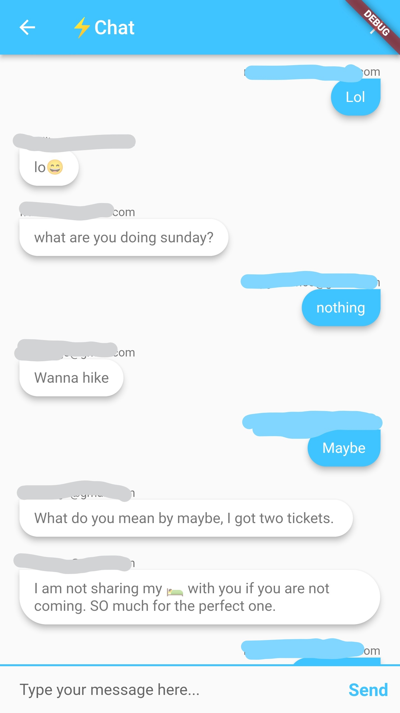

# Firechat  

## Introduction
This is a simple four page android chat application created with flutter and firebase. 

## Requirements
  - flutter ^2.10
  - dependencies:
    - animated_text_kit: ^4.2.1
    - firebase_core: ^1.6.0
    - firebase_auth: ^3.1.1
    - modal_progress_hud_nsn: ^0.1.0-nullsafety-0
    - cloud_firestore: ^2.5.3

## Getting Started

 Firebase intergration
 -create an account with google/firebase
    - add the email and password authentication
    - add cloud firestore storage
 
 
 In app level build.gradle file

     
     //Your application Id should match the application Id you created in the firebase console
      defaultConfig {
              // TODO: Specify your own unique Application ID (https://developer.android.com/studio/build/application-id.html).
              applicationId "com.rawllings.fire_chat"
              minSdkVersion 21
              targetSdkVersion 30
              versionCode flutterVersionCode.toInteger()
              versionName flutterVersionName
          }
 
 Make sure the following dependencies are present
 
     dependencies {
         implementation "org.jetbrains.kotlin:kotlin-stdlib-jdk7:$kotlin_version"
         implementation platform('com.google.firebase:firebase-bom:28.4.1')
         implementation 'com.google.firebase:firebase-analytics'
     }
     
     apply plugin: 'com.google.gms.google-services'
     
 
 In the plaform level build.gradle
 
 Ensure that you dependencies have these:
 
 '''dart
  dependencies {
         classpath 'com.android.tools.build:gradle:4.1.0'
         classpath "org.jetbrains.kotlin:kotlin-gradle-plugin:$kotlin_version"
         classpath 'com.google.gms:google-services:4.3.10'
     }
 '''
 
 
 The app should now run with no issues.
 

